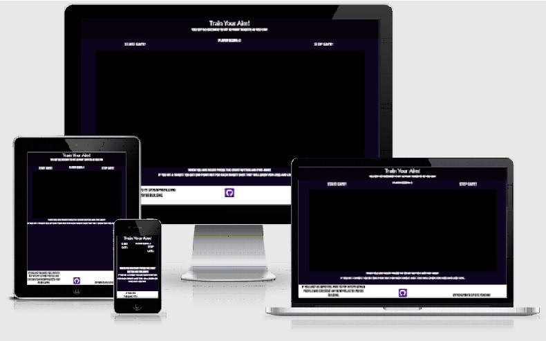
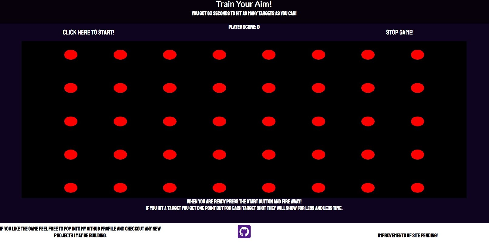
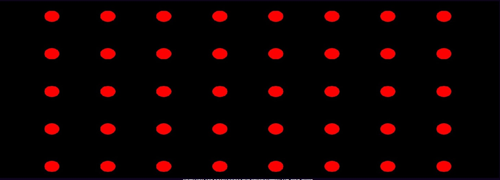
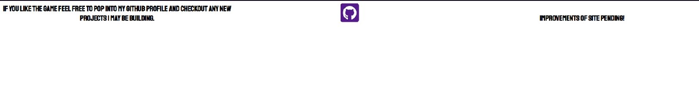

# Responsivness

* **Only made responsive down to 982px because anything less than this the game loses it charm.**

# Shoot Them!

* [LINK FOR LIVE VIEW](https://knasten.github.io/shoot-them/)

# Content

1. Presentation
2. Features
3. Testing
4. Bugs
5. Validation
6. Tools
7. Deployment
8. Credits

# Presentation

* Shooter game in which you are supposed to hit the targets as they appear. You got 60 seconds to rack up as many points as possible.
* Made by me as part of an education to become an full-stacked-developer.
  

# Features

* Header
    * Small header with a heading and a small piece of text "You Got 60 Seconds To Hit As Many Targets As You Can!"

* Controls
    * Start button starts the game on player command.
    * Stop button stops the game on player command. (If not stopped by player script stops it after 60 seconds has passed.)
    * Score
        * In the middle top of the gamewindow you can find your score. This increases each time you successfully hits a target.
        * For each score you get the time the target appears lessens by 10ms

* Game-Window
    * It is in this window the game will be played, all targets appear within this window.
    * Targets
        * Theese you will find all over in the game window. How ever they are not visible until made active by script.
        * When made active by script an event viewer is added to record any click on the targets.

* Text
    * Just below game window you can find a small box of text explaining the game rules.

* Footer
    * Here you can find a link to my Github profile page. Opens in a new tab for better user experience.
    * You can also find information text and as written in footer the game will be improved later.

# Testing

* I have tested responsiveness in Chrome Devtools down to 982px and it works fine.
* Page was tested in several different browsers including chrome, firefox and Microsoft Edge.
* Game has been tested and no errors have been located.

# Bugs
* Upon deploying the website I noticed that script and stylesheet was not being loaded as intended. I soon realised it had to do with my pathways not being correct. After adding "./" to all pathways it is working.
* No found bugs was left unfixed.
* Any bug reports can be sent to hampusjojo@gmail.com for review.
# Validation

* HTML
    * No Faults when runnning it through the WSC3 Validator.
    * 
* CSS
    * No Faults when runnning it through the Jigsaw Validator.
    * 

# Tools

* Gitpod was used during the process of making this website.
    * HTML5 was used for marking up the website.
    * CSS3 was used for styling the website.
    * JavaScript was used for the logic of my website.
* I used [GitHub](https://github.com/) to deploy my website.
* I used [FontAwesome Ver.5.15.4](https://fontawesome.com/) for the github icon at the bottom of the page.
* I used [Stackoverflow](https://stackoverflow.com/) to read and learn more about java while writing this.
* I also used [W3Schools](https://www.w3schools.com/) to read up about intervals and timeouts.

# Deployment

* This site was deployed to GitHub pages. Steps to deploy are as follows:
    * Go to GitHub repository and choose settings
    * From settings, choose pages tab
    * Select branch main from the menu
    * You now have a clickable live link

# Credits

* For the "function scoreIncrement()" I borrowed code from our love maths project we did in school just prior to starting this portfolio project. (Credit goes to CodeInstitute)