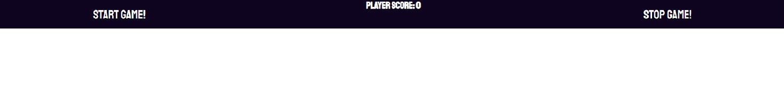

# Responsivness

# Shoot Them!

<a href="https://knasten.github.io/shoot-them/" target="_blank" rel="noopener">Link To Website</a>

# Content

1. [Presentation](#Presentation)
2. [Wireframes](#Wireframes)
3. [Colors](#Colors)
4. [Features](#Features)
5. [Testing](#Testing)
6. [Bugs](#Bugs)
7. [Validation](#Validation)
8. [Tools](#Tools)
9. [Deployment](#Deployment)
10. [Credits](#Credits)
11. [Update 1.1](#Update-1.1)

# Presentation | [top](#Responsivness)

* Shooter game in which you are supposed to hit the targets as they appear. You got 60 seconds to rack up as many points as possible.
* My main purpose of this site was to create an easy yet viable way to train your aim and muscle memory.
  - Aswell as make it possible for more people to train their aim no matter what equipment they are presented with.
* Made by me as part of an education to become an full-stacked-developer.
  

# Wireframes | [top](#Responsivness)
- Wireframes was made prior to updating the site.
- I wanted to use a wireframe because this makes it easier to envision the site and how to make it a reality.
- It was made using [Uizard](https://uizard.io/)
    

# Colors | [top](#Responsivness)
- For header I choose to go with a dark purple color, I wanted a dark color to make it stick out.
- For game background I went with the classic black. This makes the targets appear much brighter and therefore easier to spot.
- The targets are red and I choose this color because it will really stand out against the black.
- If the stop button is active it displays with a bright red color representing danger/warning
- If the start button is active it displays with a light-purple color to show it is active. Matching the header.
- If the stop/start button is inactive it displays with a gray color to show that it is inactive.

# Features | [top](#Responsivness)

* Header
    * Main purpose for the header is to introduce the user to the site.
    * Has a purple backgound color which I think goes along very well with the theme.

* Controls
    * Start button, linked to start game function and is disabled upon game start.
    * Stop button, linked to stop game function and is enabled upon game start.
     - If game hasn't been stopped before 60 seconds has passed, the game calls the stop function by itself.
     
    * Score
        * In the middle top of the gamewindow you can find your score. This increases each time you successfully hits a target.
        * For each score you get, targets visible time decreases with 10ms
* Game-Window
    * It is in this window the game will be played, all targets appear within this window.
    * Targets
        * Theese are created upon loading the window.
          - Depending on screen-size different amount of targets appear.

* Text
    * Just below game window you can find a small box of text explaining the game rules. (This has been changed to alertbox)

* Footer
    * Here you can find a link to my Github profile page. Opens in a new tab for better user experience.
    * You can also find information text and as written in footer the game will be improved later.

# Testing | [top](#Responsivness)

* Tested this site using responsiveness tools.
* Tested to work on phones, tablets and PC's
* Tested on phone (OnePlus 7 Pro) everything worked and looked neat.
* Page was tested in several different browsers including chrome, firefox and Microsoft Edge.
* I have manually tested that.. 
    * you can only start one game at a time
    * if a game has ended you are able to start a new one.
    * number of targets should always coincide with actual targets on screen.
    * targets do not appear outside of gamewindow
    * when target is hit score increases
    * timer is working and counting down
    * when timer reaches 0 game ends.
    * Upon starting game start button is disabled and stop button enabled
    * Upon ending game start button is enabled and stop button disabled

# Bugs | [top](#Responsivness)
* Upon deploying the website I noticed that script and stylesheet was not being loaded as intended. I soon realised it had to do with my pathways not being correct. After adding "./" to all pathways it is working.
* Any bug reports can be sent to hampusjojo@gmail.com for review.

# Validation | [top](#Responsivness)

* HTML
    * No Faults when runnning it through the WSC3 Validator. 
     
* CSS
    * No Faults when runnning it through the Jigsaw Validator. 
     
* JavaScript
    * One error found which exist cause I call the function from within the HTML. 
     

# Tools | [top](#Responsivness)

* Gitpod was used during the process of making this website.
    * HTML5 was used for marking up the website.
    * CSS3 was used for styling the website.
    * JavaScript was used for the logic of my website.
* I used [GitHub](https://github.com/) to deploy my website.
* I used [FontAwesome Ver.5.15.4](https://fontawesome.com/) for the github icon at the bottom of the page and the icon next to page name. (favicon)
* I used [Stackoverflow](https://stackoverflow.com/) to read and learn more about java while writing this.
* I also used [W3Schools](https://www.w3schools.com/) to read up about intervals and timeouts.
* I used [Lighthouse](https://developers.google.com/web/tools/lighthouse) to evaluate my website.  

# Deployment | [top](#Responsivness)

* To deploy this project follow steps below:
  -  Go to [repository](https://github.com/Knasten/shoot-them)
  -  Click the green gitpod button
  -  Make any desired changes too code or html
  -  Save your repository
  -  Locate your repository
  -  Enter settings for your repository
  -  Click pages tab on the navbar to the left
  -  Select your branch from the drop-down menu
  -  Deploy.
  -  Deployed! You should now have a clickable link which should look like this "https://GITHUB_USERNAME.github.io/REPOSITORY_NAME/"

# Credits | [top](#Responsivness)

* For the "function scoreIncrement()" I borrowed code from our love maths project we did in school just prior to starting this portfolio project. (Credit goes to CodeInstitute)

--------------------------------------------------------------------------------------------------------------------------------------------------------------------
    
    
# Update 1.1 | [top](#Responsivness)

## New implementations
 - Added function to create targets based on screen size
 - Better sized targets
 - Phones have smaller sized targets, this to fit some more targets and make it more scaleable for smaller screens
 - Buttons have feedback for user and shuts off depending on if game is started or not
 - Added timer

## Future Implemetations
 - Add possibility for the user to select number of targets
 - Add possibility to select how long targets appear
 - Scoreboard to keep track of who has gotten the best score.
 - Regional scoreboard to keep track of score in your closer proximity

## New UI
 - Buttons has gotten a touch up. Added JS to disable and change classes depending on game state.
 - New timer can be seen under the score to better keep track of progress.
 - Besides this it is a general touch up of how it used to look.
 - Most of text has been put to alert boxes to clean up the looks of the site.

## Testing
 - Buttons has been manually tested both in-game and out of game.
 - Game has been test run and after finished round. Player gets the wanted feedback.

## Bugfixes / User Concern Fixes [top](#Responsivness)
 - Before players could start several games at once, this has been resolved.
 - No feedback for user, solved by adding timer and alerts after each game.
 - Game ended too early, increased round time by 300ms
 - stopGame(); sometimes ran it sequence twice, now controlled by an if statement.
 - Container not fiting on some sizes, solved by adding more variants of number of targets.